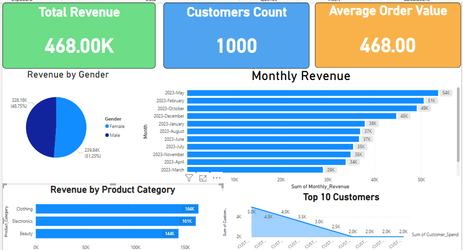

# Sales Dashboard Project

## 📌 Overview
This project demonstrates a complete data pipeline:
1. **ETL with Python (Jupyter Notebook)** → cleaning & preparing sales data.  
2. **SQL Queries (SSMS)** → building business KPIs views.  
3. **Power BI Dashboard** → interactive visualization of insights.  

## 📊 KPIs Included
- Total Revenue  
- Monthly Revenue  
- Average Order Value  
- Unique Customers  
- Top Customers  
- Sales by Gender  
- Top Product Categories  

## 🖼️ Dashboard Preview

## 🛠️ Files in Repository
- `ETL.ipy` → ETL process in Jupyter Notebook.  
- `queries.sql` → SQL queries to build views.  
- `dashboard.png` → Power BI dashboard screenshot.  
- `README.md` → Project documentation.  

## 🚀 How to Use
1. Run the ETL script in Jupyter Notebook.  
2. Import `queries.sql` into SQL Server Management Studio (SSMS).  
3. Connect Power BI to SQL Server or CSV exports.  
4. Explore and interact with the dashboard.